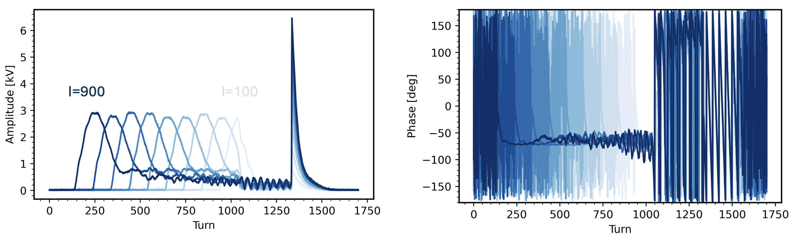
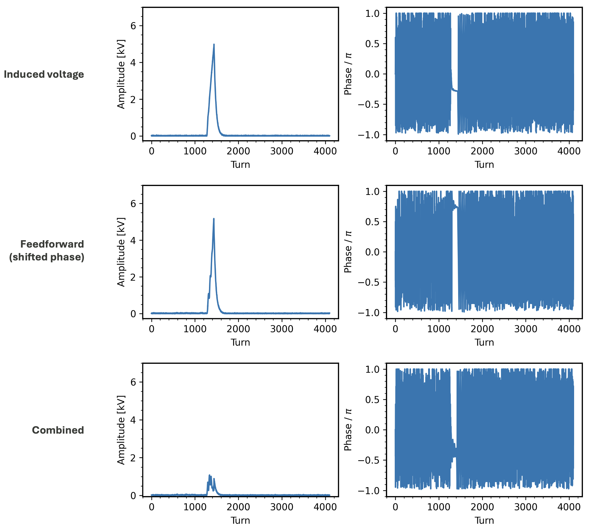

The goal of these experiments is to longitudinally compress a full-intensity proton bunch in the SNS ring. The first step is to minimize the growth in energy spread during accumulation, since the final compressed bunch length scales inversely with the initial energy spread. Ideally we'd use a [barrier cavity](https://journals.aps.org/prab/pdf/10.1103/PhysRevAccelBeams.25.050101), but we don't have one at the SNS, so we're seeing what we can do with the current RF system. We got to try a few approaches last year between a pair of long shutdowns (three months each).

#### Feedback

The main problem during accumulation is *beam loading*: the beam induces a voltage in the cavity. The induced voltage exceeds the maximum allowed value after only a few hundred turns of accumulation, so higher beam intensities require offsetting the voltage by modifying the cavity drive signal (amplitude and phase) in response to the beam. At the SNS, this is done automatically by a [feedback control loop](https://en.wikipedia.org/wiki/Proportional–integral–derivative_controller) which adjusts the drive amplitude and phase until they match the readback values.

We wanted to see if the feedback system could completely offset the induced voltage. To test this, we set the requested voltage to zero and gradually increased the beam intensity. The figure below shows the measured voltages and phases. The light curve corresponds to 100-turn injection and the dark curve to 900-turn injection. Note that the curves are offset horizontally because the extraction time is fixed; we shift things backward to accumulate more turns.

Each curve shows a similar voltage spike at the beginning of injection, then an asymptotic decrease until extraction. One important result is that the induced voltage never exceeds 3 kV. The compression ratio is approximately the square root of the voltage ratio before/after compression, so with a 10 kV compression voltage, we could expect a minimum compression ratio of 1.8 in the worst case. The average voltage is less than 3 kV, so the maximum compression ratio could be much larger.

I don't completely understand the shape of the voltage curves. After the experiment, we noticed that the injected pulse width (i.e. intensity) was linearly ramped over the first 100 turns, the same period as the initial voltage spike. It's possible that the feedback system doesn't perform well when the intensity per pulse is changing, but I'll need to simulate the beam-cavity interaction and feedback system to understand this better. Anyway, we should be able to correct this in the next experiment by reducing the pulse width ramp time.

#### Feedforward

In another experiment, we started to look at *feedforward* approaches. The idea is to generate a correction waveform based on the entire voltage curve rather than on the fly. We implemented a custom waveform generator and did a quick test. The first row in the figure below shows the induced voltage and phase for a low-intensity 100-turn injection. The second row shows a correction signal with the same amplitude but a phase shifted by 180 degrees. The third row shows the beam-induced voltage with the correction signal applied. The signal is mostly damped, as intended, although some signal remains.

{}

#### Next steps

The hope is that the feedback and feedforward systems can work together to stamp out the beam-induced voltage during high-intensity accumulation. It's a little complicated when the feedback is included because the feedforward waveform changes the beam dynamics on the subsequent injection cycle. This suggests an iterative approach. But I'm guessing it won't actually be that difficult since the feedback seems to be doing well on its own.
